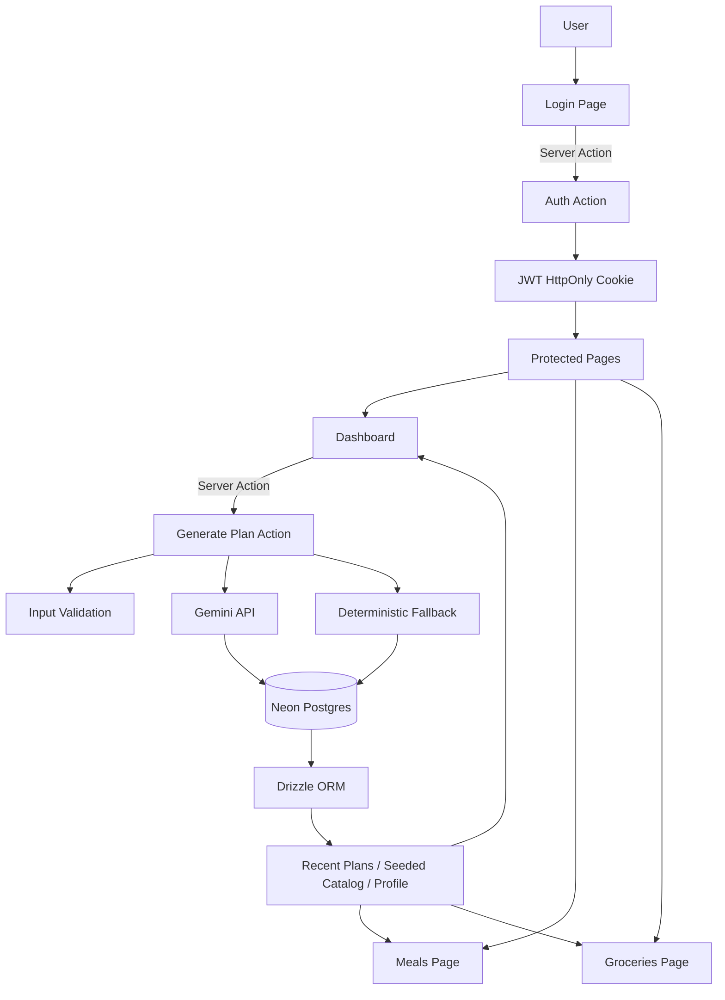
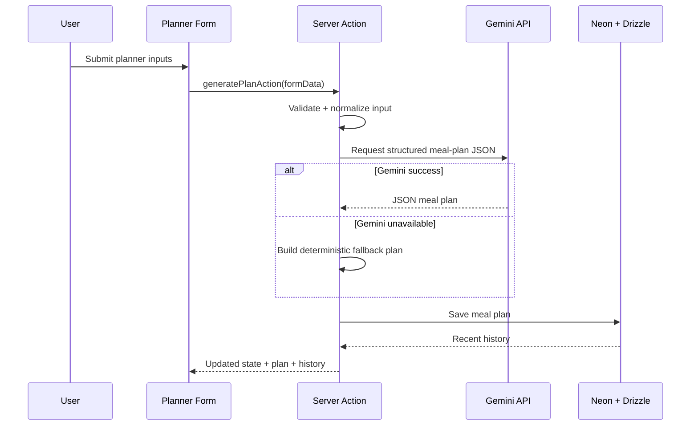

# SpiceRoute Planner

An AI-powered cooking micro-app for a food lover from **Jodhpur**, shaped by memories from **Bhopal**, and now cooking in **Bengaluru**. The app generates a personal cooking to-do list with:

- breakfast / lunch / dinner plan
- grocery list
- substitutions
- budget feasibility logic
- saved plan history
- protected multi-page experience

## Highlights

- **Gemini-powered meal planning** with structured JSON output
- **Server Actions** for plan generation and login flow
- **JWT cookie authentication** with protected routes
- **Neon Postgres + Drizzle ORM** persistence
- **Seeded ingredient pricing and planner options**
- **Multi-page UI** inspired by the Herb & Hearth Stitch design system
- **Fallback plan generation** when Gemini is unavailable

## Pages

- `/login` – secure username/password login
- `/dashboard` – planner inputs + generated AI plan
- `/meals` – dedicated meal-card view
- `/groceries` – grocery and budget-focused view

## Demo login

After running the seed script:

- **username:** `chefayush`
- **password:** `PromptWars@123`

If you override `SEED_DEMO_PASSWORD` in `.env`, the seeded password will use that value instead.

## Environment variables

Create `.env` from `.env.example`:

```bash
DATABASE_URL="postgresql://..."
GEMINI_API_KEY="..."
GEMINI_MODEL="gemini-2.5-flash"
AUTH_SECRET="your-long-random-secret"
SEED_DEMO_PASSWORD="PromptWars@123"
```

## Getting started

```bash
pnpm install
pnpm seed
pnpm dev
```

Open `http://localhost:3000`.

## Scripts

```bash
pnpm dev
pnpm seed
pnpm lint
pnpm test
pnpm build
```

## Architecture



## Request / generation flow



## Folder overview

- `app/actions.ts` – login/logout and plan-generation server actions
- `app/dashboard/page.tsx` – protected planner dashboard
- `app/meals/page.tsx` – protected meal overview page
- `app/groceries/page.tsx` – protected grocery/budget page
- `app/login/*` – login UI
- `app/planner-form.tsx` – modular planner client UI
- `app/components/protected-header.tsx` – shared protected-page navigation
- `lib/auth.ts` – password hashing, JWT signing, session helpers
- `lib/planner.ts` – validation, prompt building, fallback logic, normalization
- `lib/repository.ts` – DB setup and data access
- `lib/schema.ts` – Drizzle schema
- `scripts/seed.ts` – DB seeding
- `data/seed/*` – profile, options, ingredient catalog seed data
- `DESIGN.md` – Herb & Hearth-inspired design system summary
- `context.md` – project change log and implementation context

## Security notes

- JWT stored in **HttpOnly** cookie
- protected routes enforced by **proxy.ts**
- passwords stored as **scrypt hashes**
- secrets remain server-side only
- user inputs validated before model/database usage
- Gemini responses normalized before rendering

## Testing and verification

```bash
pnpm lint
pnpm test
pnpm build
```

Verified locally:
- lint passes
- vitest passes
- production build passes
- seed script runs against Neon

## GenAI usage

- **Google Gemini API** is used in `generatePlanAction` to create structured day-based meal plans.
- It generates meal suggestions, grocery lists, substitutions, budget reasoning, and timeline structure.
- The app falls back to seeded deterministic planning if Gemini is unavailable.

## Submission-ready summary

See `SUBMISSION_NOTES.md` for the concise deployed-version summary and GenAI-services note you can paste into the challenge form.
